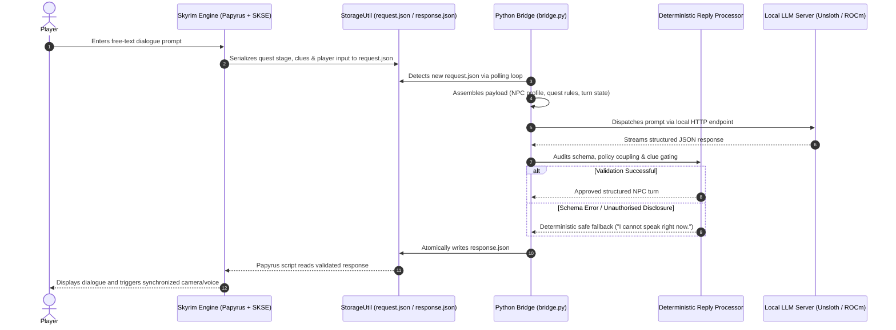

# 🐉 Skyrim LLM Bridge

[](https://opensource.org/licenses/MIT)
[](https://www.python.org/downloads/)
[](#)
[](#)
[](#)

> **A deterministic, state-bounded LLM integration for *The Elder Scrolls V: Skyrim*, powered by local edge inference on consumer hardware.**

---

## 📑 Table of Contents

- [Overview](#-overview)
- [Key Engineering Highlights](#-key-engineering-highlights)
- [Empirical Benchmarks & Evaluation](#-empirical-benchmarks--evaluation)
  - [State-Machine Routing Accuracy](#1-state-machine-routing-accuracy)
  - [Latency & Hardware Efficiency](#2-latency--hardware-efficiency)
  - [Qualitative Dialogue Assessment](#3-qualitative-dialogue-assessment)
  - [Narrative Security & Epistemic Boundaries](#4-narrative-security--epistemic-boundaries)
- [System Architecture](#-system-architecture)
  - [Request Lifecycle](#request-lifecycle)
  - [Structured Output Contract](#structured-output-contract)
- [Technical Stack](#-technical-stack)
- [Repository Structure](#-repository-structure)
- [Installation & Quickstart](#-installation--quickstart)
  - [Mode A: Standalone AI Verification](#option-a-standalone-ai-verification-no-skyrim-required)
  - [Mode B: Full In-Game Integration](#option-b-full-in-game-skyrim-integration)
- [Academic Citation](#-academic-citation)
- [License](#-license)

---

## 📖 Overview

Integrating Large Language Models (LLMs) into video game environments presents a fundamental engineering challenge: **unbounded generative models are inherently non-deterministic, whereas game engines demand rigid, authoritative state progression.**

Unconstrained conversational agents routinely suffer from critical failure modes in interactive games:
* **Hallucinated Lore:** Inventing non-existent characters, locations, or historical events.
* **Premature Clue Disclosure:** Leaking critical mystery spoilers and breaking quest logic.
* **Epistemic Violations:** Exhibiting psychic omniscience beyond what the character could plausibly observe.
* **Prompt Injection Vulnerability:** Succumbing to player instructions that override game boundaries.

The **Skyrim LLM Bridge** resolves this tension by strictly subordinating local LLMs to an **authoritative, deterministic state machine**. Rather than granting the language model direct execution authority, the model operates as an *untrusted proposal engine*. Every generated output is validated at runtime against active quest policies, acquired evidence flags, and character epistemic bounds before dialogue or state transitions reach the game engine.

```
       ┌────────────────────────┐
       │   Player Free-Text     │
       └───────────┬────────────┘
                   ▼
       ┌────────────────────────┐
       │  Local Edge LLM (2B)   │  ──► Generates Candidate JSON Proposal
       └───────────┬────────────┘
                   ▼
┌──────────────────────────────────────┐
│    Deterministic Python Validator    │  ──► Audits Schema, Policies & Epistemic Clues
└──────────────────┬───────────────────┘
                   ├───────────────────────────────┐
         [Passed: Validated Turn]        [Failed: Schema/Leak Violation]
                   ▼                               ▼
┌──────────────────────────────────────┐  ┌──────────────────────────────────────┐
│  Dispatched to Skyrim Papyrus Engine │  │   Safe Fallback Dialogue Triggered   │
└──────────────────────────────────────┘  └──────────────────────────────────────┘
```

---

## 💡 Key Engineering Highlights

* ⚡ **Sub-Second Edge Latency:** Achieves a **0.98s median end-to-end response time** running fully locally on consumer GPU hardware.
* 🛡️ **Zero Hallucination Leaks:** External deterministic validation guarantees that unearned quest clues and invalid states never reach the game engine.
* 🏆 **Small-Model Specialization:** Demonstrates that a **domain-adapted 2B parameter model (53.4% routing accuracy)** decisively outperforms an unadapted **26B MoE model (29.0%)** on structured game-state routing.
* 🎮 **Decoupled Asynchronous I/O:** File-based message passing ensures inference latency never blocks Skyrim's main rendering thread or Papyrus script scheduler.
* 🔒 **Hardware-Aware QLoRA Adaptation:** Trained within a strict 16 GB VRAM consumer workstation budget using custom structural prompt compression and Unsloth acceleration.

---

## 📊 Empirical Benchmarks & Evaluation

This architecture was subjected to rigorous empirical evaluation across **1,500 deterministic inference trials** (100 frozen test cases across 5 random seeds: `42, 101, 202, 303, 404`) on consumer workstation hardware (**AMD Radeon RX 6900 XT / 16 GB VRAM**) using the **Unsloth** inference backend.

### 1. State-Machine Routing Accuracy

The primary quantitative objective measured whether candidate models correctly coupled natural language intent to the exact deterministic policy and response type required by the Skyrim Papyrus state machine.

| Model Configuration | Parameter Scale | Quantization | Routing Accuracy | 95% Confidence Interval |
| :--- | :---: | :---: | :---: | :---: |
| **Base Gemma 4** (Zero-Shot) | 2 Billion | 4-bit (BNB) | 19.0% | $\pm 1.76\%$ |
| **Base Gemma 4 26B-A4B** (Zero-Shot) | 26 Billion (MoE) | IQ4_XS | 29.0% | $\pm 3.17\%$ |
| **Fine-Tuned Gemma 4** (QLoRA) | **2 Billion** | **4-bit (GGUF)** | **53.4%** 🏆 | **$\pm 3.24\%$** |

> **Statistical Significance:** Paired $t$-tests with Bonferroni correction ($\\alpha = 0.0167, t_{	ext{crit}} \\approx 2.39$) confirm that the Fine-Tuned 2B model significantly outperforms both the Base 2B model ($t = 14.08, p < 0.001$) and the 13× larger Base 26B MoE model ($t = 9.81, p < 0.001$), decisively breaking the *taxonomy coupling barrier*.

---

### 2. Latency & Hardware Efficiency

For real-time interactive game dialogue, end-to-end latency must remain below **2.0 seconds** to preserve immersion, while leaving sufficient VRAM for game assets and rendering.

| Benchmark Metric | Base 2B (Zero-Shot) | Fine-Tuned 2B (QLoRA) | Base 26B MoE (Zero-Shot) | Interactive Target |
| :--- | :---: | :---: | :---: | :---: |
| **Median End-to-End Latency** | 0.92 s | **0.98 s** ⚡ | 2.43 s | $< 2.0	ext{ s}$ |
| **Mean End-to-End Latency** | 0.95 s | **1.91 s** | 2.50 s | $< 2.0	ext{ s}$ |
| **95th Percentile (P95) Latency** | 1.15 s | **1.25 s** | 3.10 s | $< 2.0	ext{ s}$ |
| **Generation Throughput** | 38.5 TPS | **36.2 TPS** | 14.1 TPS | $> 30	ext{ TPS}$ |
| **Peak VRAM Allocation** | 5.5 GB | **7.1 GB** 💾 | 15.6 GB | $< 16.0	ext{ GB}$ |
| **Interactive Viability** | ⚠️ Poor Routing Accuracy (19.0%) | ✅ **Production Ready** | ❌ Fails Latency Threshold | — |

*Note: All latency figures represent full round-trip execution (prompt serialisation, network transit, token generation, deterministic validation, and file persistence). Peak VRAM figures are inclusive of OS background allocation.*

---

### 3. Qualitative Dialogue Assessment

To evaluate linguistic believability and verify that rigid JSON fine-tuning did not cause catastrophic forgetting, dialogues were evaluated across four dimensions using frontier models (GPT & Claude) with a **blinded third-rater human adjudication protocol** on an anchored 1–5 scale.

| Qualitative Dimension | Base 2B | Fine-Tuned 2B | Score Delta ($\Delta$) | Evaluative Focus |
| :--- | :---: | :---: | :---: | :--- |
| **Persona Adherence** | 3.84 | **3.98** | `+0.14` | Alignment with Runa's cautious, pragmatic character traits |
| **Epistemic Grounding** | 4.65 | **4.70** | `+0.05` | Adherence to first-hand sensory evidence (no omniscience) |
| **Skyrim Lore & Tone** | 3.57 | 3.50 | `-0.07` | Lexical authenticity; absence of modern vernacular |
| **Naturalness & Fluency** | 3.53 | 3.46 | `-0.07` | Conversational flow and brevity (strict 1–3 sentences) |

The slight variations in Tone and Fluency ($-0.07$) are statistically negligible, while Persona Adherence and Epistemic Grounding both improved, confirming that structured policy conditioning reinforces narrative consistency.

---

### 4. Narrative Security & Epistemic Boundaries

Premature revelation of mystery clues destroys player agency. The test suite evaluated resistance to adversarial prompt injection and unearned clue extraction across 500 trials per model:

* **Base 26B MoE:** 0 leaks across 500 trials (Clopper-Pearson 95% CI: $[0.00\%, 0.74\%]$).
* **Fine-Tuned 2B:** 5 leaks across 500 trials (Clopper-Pearson 95% CI: $[0.33\%, 2.32\%]$).
* **Base 2B (Zero-Shot):** 25 leaks across 500 trials (5.0% failure rate; regularly leaked the poison clue during unguided assistance turns).

---

## 🏗️ System Architecture

### Request Lifecycle



### Structured Output Contract

The model is strictly constrained to output a single, RFC-compliant JSON object adhering to this schema:

```json
{
  "schema_version": "1.0",
  "dialogue": "I poured Vigund's mead myself, and it carried the distinct bitter reek of Nightshade.",
  "player_intent": "ask_for_information",
  "topic": "poison",
  "policy_id": "witness_reveal_c1",
  "response_type": "provide_quest_information",
  "clue_claims": ["C1"],
  "action_request": null
}
```

* **`policy_id` & `response_type` Coupling:** Each narrative policy strictly allows only specific response types. The validator immediately intercepts and rejects invalid combinations.
* **`clue_claims` Gating:** If the model asserts a clue claim (e.g., `["C1"]`) when the player has not met prerequisite quest conditions, the validator suppresses the claim.
* **`action_request` Isolation:** Game actions cannot be directly initiated by model hallucinations; they require authoritative validation.

---

## 🛠️ Technical Stack

| Layer | Technologies | Role |
| :--- | :--- | :--- |
| **Game Engine** | *The Elder Scrolls V: Skyrim Special Edition*, Papyrus, SKSE64 | Authoritative quest state, user interface, player interaction |
| **Storage & I/O** | `StorageUtil` (Papyrus plugin) | Thread-safe, cross-process atomic JSON persistence |
| **Bridge Runtime** | Python 3.10+, `requests`, `python-dotenv` | Asynchronous file polling, session management, payload routing |
| **Validation Layer** | Python (`dataclasses`, custom schema validators) | Deterministic contract enforcement, policy auditing, fail-safe fallbacks |
| **Inference Server** | Unsloth Desktop, KoboldCpp, llama.cpp | Local quantized model serving (GGUF / BnB 4-bit) |
| **Hardware Acceleration** | AMD ROCm 7.x (RX 6900 XT), NVIDIA CUDA compatible | GPU tensor acceleration for local sub-second inference |
| **Model Adaptation** | PyTorch, Hugging Face `transformers`, `trl`, QLoRA | Supervised fine-tuning of Gemma 4 (2B) on structured JSON schemas |

---

## 📁 Repository Structure

```text
SkyrimLLMBridge/
├── bridge.py                 # Core polling service and execution loop
├── data_director.py          # Quest state machine, NPC profiles, and session memory
├── llm_api_client.py         # Multi-backend HTTP client (Unsloth, KoboldCpp, OpenWebUI)
├── llm_payload_builder.py    # Structured prompt assembler and context compressor
├── llm_reply_processor.py    # Deterministic schema, taxonomy, and clue validator
├── train_lora.py             # Supervised QLoRA fine-tuning script for Gemma 4 (2B)
├── dataset_builder.py        # Synthetic dataset curation and validation pipeline
├── dataset_train_v3.jsonl    # Production QLoRA training dataset (479 KB)
├── dataset_eval_v3.jsonl     # Production validation dataset split
├── profiles/                 # NPC epistemic profiles (tavern_witness.json, alex.json)
├── quests/                   # Declarative quest policies and clue gating (poisoned_mead.json)
├── skyrim_plugin/            # ⬅ Ready-to-install compiled Skyrim mod files
│   ├── README_INSTALL.md              # Step-by-step installation guide
│   ├── CompanionLLMV01.esp            # Main plugin (quest, NPC aliases, dialogue)
│   ├── Seq/CompanionLLMV01.seq        # Start-Enabled Quest trigger
│   └── Scripts/*.pex                  # Compiled Papyrus scripts (chat launcher, quest controller)
├── tests/                    # Deterministic benchmark runners and frozen test suites
│   ├── frozen_test_set_100.json         # Pre-registered 100-case evaluation suite
│   ├── run_frozen_evaluation_auto.py    # Automated 5-seed benchmark executor
│   └── test_comprehensive.py            # Standalone 30-case integration stress test
├── evaluation_results/       # Pre-compiled empirical inference logs (1,500 trials) & CSVs
├── SUBMISSION_OVERVIEW.md    # Academic dissertation examiner handbook
└── requirements.txt          # Production and development dependencies
```

---

## 🎮 Skyrim Plugin

The compiled Skyrim mod files are included in the [`skyrim_plugin/`](skyrim_plugin/) directory. This is the **game-engine side** of the bridge — no compilation or Creation Kit is required; the files are ready to copy directly into your Skyrim `Data` folder.

| File | What it does |
| :--- | :--- |
| `CompanionLLMV01.esp` | Defines the *Poisoned Mead* quest, NPC aliases, and all dialogue topic hooks |
| `Seq/CompanionLLMV01.seq` | Ensures the quest starts automatically on game load (required for dialogue to appear) |
| `Scripts/MMJ_TavernWitnessChatLauncher.pex` | The core bridge script — writes `request.json`, polls for `response.json`, and feeds dialogue back to the engine |
| `Scripts/MMJ_PoisonedMeadQuestScript.pex` | Controls quest stage progression as clues are revealed |
| `Scripts/TIF__*.pex` + `QF_*.pex` | Auto-generated Creation Kit dialogue and quest fragments |

👉 See **[`skyrim_plugin/README_INSTALL.md`](skyrim_plugin/README_INSTALL.md)** for the full step-by-step installation guide.

---

## 🚀 Installation & Quickstart

### Prerequisites

* **Operating System:** Windows 10/11
* **Python:** 3.10 or higher
* **GPU:** 8 GB+ VRAM for local inference (tested on AMD Radeon RX 6900 XT 16 GB; NVIDIA CUDA compatible)
* **Skyrim Special Edition** (v1.6.x / Anniversary Edition) + the following mods for in-game integration:

| Skyrim Mod | Purpose |
| :--- | :--- |
| [SKSE64](https://skse.silverlock.org/) | Script Extender — launch via `skse64_loader.exe` |
| [Address Library — All In One](https://www.nexusmods.com/skyrimspecialedition/mods/32444) | Version-independent offsets required by all SKSE plugins below |
| [SkyUI](https://www.nexusmods.com/skyrimspecialedition/mods/12604) | In-game UI and dialogue menu system |
| [PapyrusUtil AE/SE](https://www.nexusmods.com/skyrimspecialedition/mods/13048) | `JsonUtil` / `StorageUtil` — JSON file I/O bridge layer |
| [Papyrus Extender](https://www.nexusmods.com/skyrimspecialedition/mods/22854) | Extended Papyrus script functions |
| [DbMiscFunctions](https://www.nexusmods.com/skyrimspecialedition/mods/18901) | Utility scripting library for UI components |
| [Extended Vanilla Menus](https://www.nexusmods.com/skyrimspecialedition/mods/49900) | Free-text player input interface |
| [ConsoleUtilSSE NG](https://www.nexusmods.com/skyrimspecialedition/mods/76649) | Console utility functions used by the scripting stack |

> The AI evaluation and Python bridge can be run entirely **without Skyrim installed** — see Option A below.

---

### Option A: Standalone AI Verification (No Skyrim Required)

You can reproduce the full deterministic reasoning pipeline, prompt construction, and validation suite **without installing Skyrim**:

1. **Clone the repository:**
   ```bash
   git clone https://github.com/yourusername/skyrim-llm-bridge.git
   cd skyrim-llm-bridge
   ```

2. **Install core runtime dependencies:**
   ```bash
   pip install -r requirements.txt
   ```

3. **Configure environment:**
   ```bash
   copy .env.example .env    # On Windows (or 'cp .env.example .env' on Linux)
   ```
   Open `.env` and verify that `LLM_PROVIDER` points to your local model server (Unsloth Desktop, KoboldCpp, or any OpenAI-compatible endpoint).

4. **Run the standalone test suite:**
   ```bash
   # Run the 30-case integration stress test:
   python tests/test_comprehensive.py

   # Or execute the full 100-case multi-seed evaluation runner:
   python tests/run_frozen_evaluation_auto.py
   ```

---

### Option B: Full In-Game Skyrim Integration

For live interactive gameplay inside *The Elder Scrolls V: Skyrim*:

1. **Prerequisites:**
   * *Skyrim Special Edition* (v1.6.x)
   * [Skyrim Script Extender (SKSE64)](https://skse.silverlock.org/)
   * [StorageUtil / PapyrusUtil SE](https://www.nexusmods.com/skyrimspecialedition/mods/13048)

2. **Configure Skyrim Data Directory:**
   In your `.env` file, point `SKYRIM_DATA_DIR` to your SKSE storage folder:
   ```ini
   SKYRIM_DATA_DIR=C:\Games\Skyrim Special Edition\Data\SKSE\Plugins\StorageUtilData\CompanionLLM
   ```

3. **Launch the Bridge Service:**
   ```bash
   python bridge.py
   ```
   The bridge will enter active polling mode, monitoring `request.json`.

4. **Launch Skyrim via SKSE64:**
   Start the game using `skse64_loader.exe`. Approach Runa in *The Bannered Mare* (Whiterun) and initiate conversation using free-text input.

---

## 🎓 Academic Citation

This project was conceived, implemented, and defended as part of an MSc in Artificial Intelligence dissertation at **Cardiff University** (School of Computer Science and Informatics).

If you build upon this architecture or reference the deterministic game-state benchmark, please cite:

```bibtex
@mastersthesis{jahangiri2026skyrimllm,
  author  = {Mohammed Mahdi Jahangiri},
  title   = {Technical Feasibility and Narrative Reliability of a Locally Hosted LLM-Driven NPC in Skyrim: An Automated Evaluation of Performance and Rule Compliance on Consumer Hardware},
  school  = {Cardiff University},
  year    = {2026},
  month   = {September},
  type    = {MSc Artificial Intelligence Dissertation}
}
```

---

## 📜 License

This project is licensed under the **MIT License**. Game assets, lore, and Skyrim engine interfaces remain the intellectual property of Bethesda Softworks. This project is an independent academic research artefact and is not affiliated with or endorsed by Bethesda Softworks.
